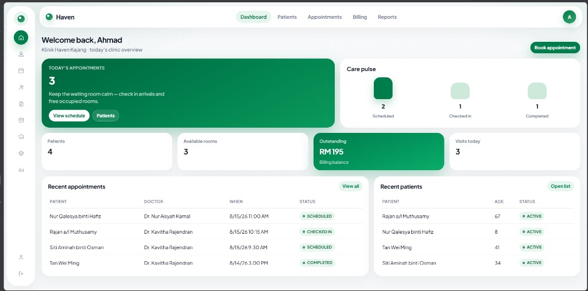

# Haven Clinic Management System

**Haven** is a clinic and hospital management SaaS built with **Java** and **Spring Boot**.

It gives a small clinic one workspace for the work that happens every day: patients, appointments, doctors, prescriptions, billing, rooms, inventory, and reports. Visitors can browse a public website, try a one-click demo, or register their own clinic account.

Local URL after you start the app: [http://localhost:8088](http://localhost:8088)

---

## Dashboard preview

This is the clinic workspace after login. The layout is built around a calm forest-green palette, a slim icon rail, and rounded cards so staff can see today’s work at a glance.



**How to read this screen**

| Area | What it does |
|------|----------------|
| **Left icon rail** | Quick jump to Dashboard, Patients, Appointments, Doctors, Prescriptions, Billing, Rooms, Inventory, Reports, Profile, and Sign out |
| **Top bar** | Haven logo, main links (Dashboard, Patients, Appointments, Billing, Reports), and the signed-in user avatar |
| **Welcome header** | Greets the doctor and names the clinic. **Book appointment** is the primary action |
| **Today’s appointments card** | Large green card with today’s visit count and shortcuts to the schedule and patient list |
| **Care pulse** | Bar chart of **Scheduled**, **Checked in**, and **Completed** visits |
| **Stat cards** | Patients, available rooms, outstanding billing, and visits today |
| **Recent appointments** | Latest visits with patient, doctor, time, and status badges |
| **Recent patients** | Newest people under care, with age and status |

The screenshot above is the live demo: **Klinik Haven Kajang**, Malaysian patient and doctor names, and billing in **RM**.

---

## Why this system exists

Front-desk and clinical staff usually juggle paper lists, WhatsApp chats, and separate spreadsheets. Haven puts those pieces in one product:

1. **Public site** — explain the product, show pricing, and let people try it.
2. **Secure workspace** — each clinic account only sees its own patients, bills, rooms, and stock.
3. **Day-to-day operations** — book a visit, check a patient in, write a prescription, raise a bill, free a room, restock supplies.

It is meant as a complete starter you can demo, host, or customize for a real clinic.

---

## How the product is organized

### 1. Public website (no login)

Anyone can open the marketing site first.

| Page | Purpose |
|------|---------|
| **Landing** | Brand intro, Try Demo / Register / Login, features, and pricing |
| **Features** | Longer product explanation |
| **Pricing** | Solo, Practice, and Hospital Wing plans |
| **Login** | Sign in to an existing clinic |
| **Register** | Create a new clinic account |
| **Try Demo** | Instant workspace — no signup |

### 2. Clinic workspace (after login or demo)

Every clinic gets its own data. Modules:

#### Dashboard
Today’s snapshot: visit count, patient total, free rooms, outstanding money, recent appointments, recent patients, and care pulse (Scheduled / Check In / Completed).

#### Patients
People under care. Add name, age, gender, phone, blood type, and allergies. View status and remove records when needed.

#### Appointments
Daily visit board. Book a reason, patient, doctor, date, and time. Move status through **Scheduled → Check In → Completed**, or **Cancelled**.

#### Doctors
Care team roster. Add specialty, phone, and email. Mark **Active** or **On Leave**.

#### Prescriptions
Medication records linked to a patient and doctor: drug name, dosage, and instructions.

#### Billing
Patient invoices with auto numbers (`BILL-0001`, …). Status: **Pending**, **Paid**, **Overdue**. Dashboard and reports show paid vs outstanding totals.

#### Rooms
Facility board for Consultation, Ward, ICU, and Lab rooms. Track capacity and **Available / Occupied / Maintenance**.

#### Inventory
Clinic stock (PPE, Pharmacy, First Aid, Lab, Other). Quantity plus reorder level, with a low-stock warning when you drop to/below the reorder point.

#### Reports
Simple operations snapshot: counts for patients, doctors, prescriptions, supplies, visits by status, room occupancy, and billing totals.

#### Profile
Open from the avatar (not a main menu item). Edit your name and clinic name, then sign out with a confirmation dialog.

---

## Authentication

| Method | What happens |
|--------|----------------|
| **Try Demo** | One click into the seeded demo clinic |
| **Register** | Creates a new clinic account, then you sign in |
| **Login** | Email + password, session-based |
| **Sign out** | Confirm with SweetAlert, then the session ends |

### Demo account

- **Email:** `demo@haven.clinic`
- **Password:** `demo1234`
- Or click **Try Demo** on the landing page

Demo data is a Malaysian clinic (**Klinik Haven Kajang**) with Malay, Chinese Malaysian, and Indian Malaysian sample patients and doctors. Billing uses **RM**.

### Demo people

| Role | Name |
|------|------|
| Clinic owner | Ahmad Faizal |
| Doctors | Dr. Ahmad Faizal, Dr. Nur Aisyah Kamal, Dr. Kavitha Rajendran |
| Patients | Siti Aminah binti Osman, Tan Wei Ming, Nur Qalesya binti Hafiz, Rajan a/l Muthusamy |

---

## Tech stack

| Layer | Technology |
|-------|------------|
| Language | Java 17 |
| Framework | Spring Boot 3.3 |
| Security | Spring Security (form login + session) |
| UI | Thymeleaf templates + custom CSS (`haven.css`) |
| Database | H2 file database (`./data/haven`) |
| ORM | Spring Data JPA / Hibernate |
| Build | Maven |

Each logged-in user owns their clinic records. The seeder only fills the demo account so a new registration starts empty.

---

## How to run

### Requirements

- JDK 17+
- Maven 3.9+ (or the bundled Maven under `.tools/` if present)

### Start

```bash
mvn spring-boot:run
```

Windows, using bundled Maven:

```bash
.\.tools\maven\apache-maven-3.9.16\bin\mvn.cmd spring-boot:run
```

Open **http://localhost:8088**

The app listens on **port 8088** (not 8080).

### Useful paths

| Path | Description |
|------|-------------|
| `/` | Landing page |
| `/demo` | Enter demo workspace |
| `/login` | Login |
| `/register` | Register |
| `/app` | Dashboard (after auth) |
| `/h2-console` | H2 database console (development) |

---

## Project structure

```
src/main/java/com/fluxa/
  config/          # Demo data seeder
  model/           # Patient, Doctor, Appointment, Bill, Room, etc.
  repository/      # JPA repositories
  security/        # Spring Security + user details
  service/         # Clinic workspace logic
  web/             # Marketing + app controllers

src/main/resources/
  static/css/      # Haven UI styles
  templates/       # Landing + workspace pages
  application.properties

docs/
  dashboard.png    # README screenshot
```

---

## Selling / customizing

Haven is structured so you can:

1. Rebrand colors and fonts in `src/main/resources/static/css/haven.css`
2. Host on a VPS, Railway, Render, or similar
3. Point website CTAs to `/demo`, `/register`, or pricing
4. Later swap H2 for PostgreSQL and add real payment (Stripe) on the pricing plans

---

## License / ownership

Built as a portfolio and sellable SaaS starter for clinic and hospital operations.
